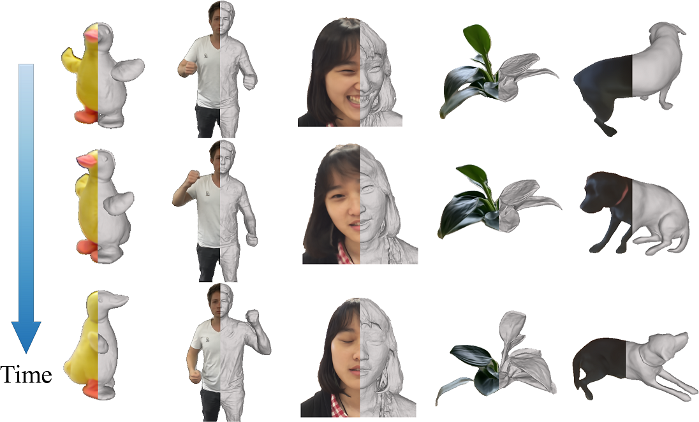

<p align="center">

  <h1 align="center">Neural Surface Reconstruction of Dynamic Scenes with Monocular RGB-D Camera</h1>
  <p align="center">
    <a href="https://rainbowrui.github.io/">Hongrui Cai</a>
    ·
    <a href="https://github.com/WanquanF">Wanquan Feng</a>
    ·
    <a href="https://scholar.google.com/citations?hl=en&user=5G-2EFcAAAAJ">Xuetao Feng</a>
    ·
    Yan Wang
    ·
    <a href="http://staff.ustc.edu.cn/~juyong/">Juyong Zhang</a>

  </p>
  <h2 align="center">NeurIPS 2022</h2>
  <h3 align="center"><a href="https://arxiv.org/pdf/2206.15258.pdf">Paper</a> | <a href="https://ustc3dv.github.io/ndr/">Project Page</a></h3>
  <div align="center"></div>
</p>

<p align="center">
  <a href="">
    
  </a>
</p>

<p align="center">
  <a href="">
    
  </a>
</p>

<p align="center">
We propose Neural-DynamicReconstruction (NDR), a <b>template-free</b> method to recover high-fidelity geometry, motions and appearance of a <b>dynamic</b> scene from a <b>monocular</b> RGB-D camera.
</p>
<br>

# Acknowledgements
This project is built upon [NeuS](https://github.com/Totoro97/NeuS). Some code snippets are also borrowed from [IDR](https://github.com/lioryariv/idr) and [NeRF-pytorch](https://github.com/yenchenlin/nerf-pytorch). The pre-processing code for camera pose initialization is borrowed from [Fast-Robust-ICP](https://github.com/yaoyx689/Fast-Robust-ICP). The evaluation code for geometry rendering is borrowed from [StereoPIFu_Code](https://github.com/CrisHY1995/StereoPIFu_Code). Thanks for these great projects. We thank all the authors for their great work and repos.

# Contact
If you have questions, please contact [Hongrui Cai](https://rainbowrui.github.io/).

# Citation
If you find our code or paper useful, please cite
```bibtex
@article{cai2022neural,
  title     = {Neural Surface Reconstruction of Dynamic Scenes with Monocular RGB-D Camera},
  author    = {Cai, Hongrui and Feng, Wanquan and Feng, Xuetao and Wang, Yan and Zhang, Juyong},
  journal   = {Thirty-sixth Conference on Neural Information Processing Systems (NeurIPS)},
  year      = {2022},
}
```