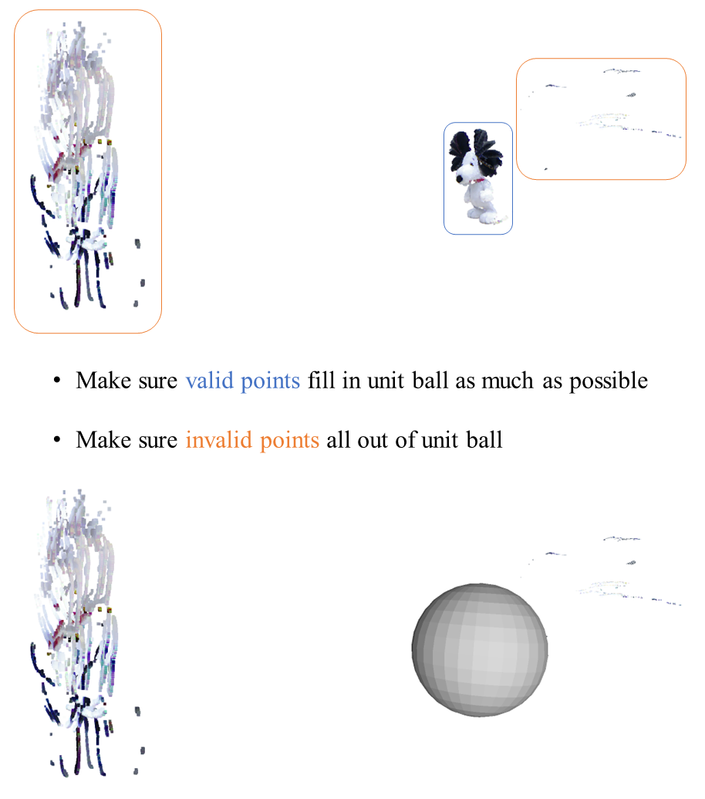

### Preparing depth, rgb and mask data
- Follow the data format as our prepared example
- All images must be in 'jpg' or 'png' format
- Count from zero, e.g. the first frame is '00000.png'
- The shape of depth is (H, W), and the shape of rgb is (H, W, 3)
- The shape of mask is (H, W, 3). Pixel in the object is [255, 255, 255], out of object is [0, 0, 0]
- <b><i>Important:</i></b> Include a file for intrinsic matrix as ['intrinsic.txt'](./files/intrinsics.txt) (containing focal length and center at least) in ```[data_path_]```

### Compiling Robust-ICP
- Clone [Robust-ICP](https://github.com/yaoyx689/Fast-Robust-ICP) in current dir
- Compile it and make sure ```FRICP``` in path ```./Fast-Robust-ICP/build/FRICP```, named as ```[FRICP_path_]```

### Step 1: Registrating depth maps with Robust-ICP
- Run
```shell
python step1.py --depth_scale [depth_scale_] --data_path [data_path_] --registration_alg_path [FRICP_path_]
```
e.g.
```shell
python step1.py --depth_scale 1000. --data_path '../datasets/kfusion_frog/' --registration_alg_path './Fast-Robust-ICP/build/FRICP'
```

### Step 2: Checking registrated depth maps scaled into unit ball
- Put [unit ball](./files/unit_ball.obj) and all depth maps from ```[data_path_]/intermediate/colored_pointclouds/``` into [MeshLab](https://www.meshlab.net/)
- Delete invalid points which are not on the object surface
- Save the result as ```[data_path_]/intermediate/ref.xyz```

<p align="center">
  <a href="">
    
  </a>
</p>

### Step 3: Obtaining camera parameters
- Run
```shell
python step3.py --depth_scale [depth_scale_] --data_path [data_path_] --object_scale [object_scale_]
```
e.g.
```shell
python step3.py --depth_scale 1000. --data_path '../datasets/kfusion_frog/' --object_scale 1.03
```
- Put [unit ball](./files/unit_ball.obj) and all depth maps from ```[data_path_]/intermediate/colored_pointclouds/``` into [MeshLab](https://www.meshlab.net/) again
- Make sure invalid points out of ball
- Make sure valid points on the object surface fill in the ball as much as possible

<b><i>Tips:</i></b> Set ```[object_scale_]``` to make sure object sequence scaled into the unit ball. Larger it is, smaller scaled object will be.